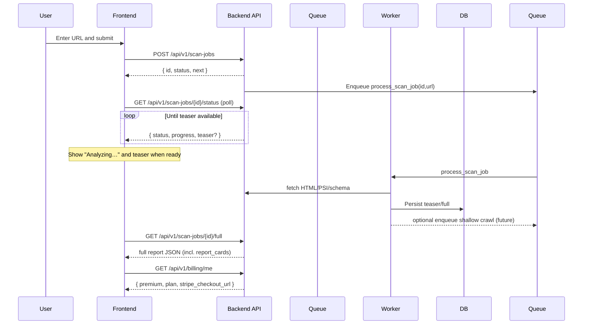

# XenlixAI Architecture Overview

## Purpose

XenlixAI analyzes a given URL and returns an actionable snapshot of SEO/AEO readiness with a special focus on local signals (NAP, schema, citations). It provides a fast teaser for free users and a richer, premium report behind Stripe Checkout. The design emphasizes data-driven scoring rules, background processing for reliability, and room to expand into a mini-crawl.

## User flow

1. User submits a URL from the frontend.
2. Backend creates a scan job and returns an ID immediately.
3. Frontend navigates to an "Analyzing…" page and polls the job status.
4. When the job enters a "teaser-ready" state, the UI shows a summary. If the user is free, they see a paywall CTA; if premium, they proceed to the full dashboard.
5. The background worker completes the full analysis, scoring, and weaknesses, and the frontend renders the premium dashboard when available.

## Main APIs

- POST {API_V1}/scans: Enqueue a scan for a URL and return a scanId.
- GET {API_V1}/scans/{scanId}: Fetch scan state and data; returns teaser early and full when ready.
- GET {API_V1}/billing/me: Returns { premium: boolean, plan: string | null, stripe_checkout_url: string | null }.
- GET {API_V1}/utils/health-check: Liveness check for startup and CI.
- GET /metrics: Optional Prometheus metrics (enabled via env and guarded so failures don't block startup).

Notes:

- {API_V1} is typically /api/v1.
- Endpoints may add fields over time without breaking existing consumers.

## Background job pipeline

- Queueing: Jobs are queued via Redis-backed RQ. The enqueue response includes a scanId for polling.
- Fetch & parse: The worker fetches HTML and extracts content and structured data (JSON-LD/microdata). It also normalizes out-links for future mini-crawl.
- Local SEO signals: NAP detection (business name, phone, email, street, city, state, postal code) plus presence of LocalBusiness/Organization schema and platform hints (e.g., Google Business, Apple Business Connect).
- Scoring: AEO/GEO scoring rules are externalized in a YAML file and applied to extracted features, producing scores and weaknesses.
- Teaser vs full: A compact teaser is produced early for fast UX; full results include detailed signals, PSI metrics if available, and recommendations.
- Storage: Results are persisted to the database keyed by scanId; transient progress may be reflected via job meta in Redis for polling.

## Data stored per scan job

A scan typically stores:

- Identity: scanId, source URL, normalized host, timestamps (created/updated), status/state.
- Teaser: title/summary, quick highlights, partial scores.
- Full: structured data, local SEO signals (NAP, schema flags, platform hints), AEO/GEO scores, weaknesses, page-level metrics (e.g., PSI), and raw extracts as needed.
- Crawl candidates (future): a set of in-scope links for mini-crawl with priority/limit metadata.

The schema is intentionally additive so we can evolve fields (e.g., add signals or PSI dimensions) without breaking consumers.

## Premium gating

- Free users see the teaser and a paywall CTA.
- Premium users see the full report (all tabs: Overview, Competitors, Citations, Recommendations, History, Analytics).
- The billing endpoint returns a dev-safe stripe_checkout_url; the frontend uses it to launch Stripe Checkout.
- Server-side checks should validate premium access before returning full details.

## Environment variables

Core environment:

- BACKEND_PUBLIC_URL: Public base URL of the API (for link generation/webhooks).
- FRONTEND_HOST: Frontend origin allowed by CORS and used for redirects.
- ENABLE_METRICS: "true" to enable Prometheus instrumentation and /metrics.

Database/queue:

- POSTGRES_SERVER, POSTGRES_USER, POSTGRES_PASSWORD, POSTGRES_DB: Database connection.
- REDIS_URL: Redis connection for RQ (e.g., redis://localhost:6379/0).

Third-party services:

- STRIPE_SECRET_KEY, STRIPE_WEBHOOK_SECRET, STRIPE_PRICE_ID: Stripe payments.
- PSI_API_KEY: PageSpeed Insights access (optional but recommended).
- SENTRY_DSN: Error monitoring (disabled for local by default).

Feature flags:

- CREW_AI_ENABLED: Enable AI assistants when available.

## Dev workflow (Windows + Docker)

- Infra: Run Postgres/Redis/Adminer with Docker Compose. No image rebuilds are required for normal dev.
- Backend: Run FastAPI on host with uvicorn --reload for hot updates.
- Worker: Run an RQ worker on host, pointing to the same Redis instance.
- Frontend: Run Vite dev server on port 5174 with --host for LAN testing.
- Metrics: If ENABLE_METRICS=true, /metrics is exposed; failures in metrics never block startup.

Quick-start options:

- Manually:
  - docker compose up -d db redis adminer
  - uvicorn app.main:app --reload --host 0.0.0.0 --port 8001
  - cd frontend && npm run dev -- --host --port 5174
  - In another terminal: python -m rq worker --url redis://localhost:6379/0 default
- Scripted: scripts/dev-host.ps1 starts db/redis/adminer; backend (Uvicorn); RQ worker; and the Vite frontend.

## Future-proofing: mini-crawl

The system is designed to add a shallow, in-scope mini-crawl:

- Scope: same host + optional allowlist; respect robots.txt; rate limited.
- Scheduling: seed with the submitted URL; enqueue a bounded number of in-scope links with deduplication.
- Storage: persist per-page signals and aggregate at the scan level (e.g., consistency of NAP across pages).
- UX: show crawl progress in the "Analyzing" view and add per-page insights to the premium dashboard.

This extension reuses the existing queue, parsing, and scoring primitives with minimal API changes (the scanId and polling remain the same; the full payload grows to include page sets and aggregates).

## System diagram

